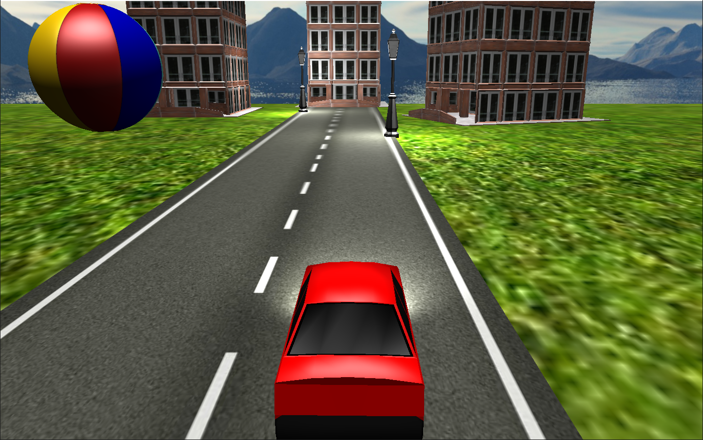
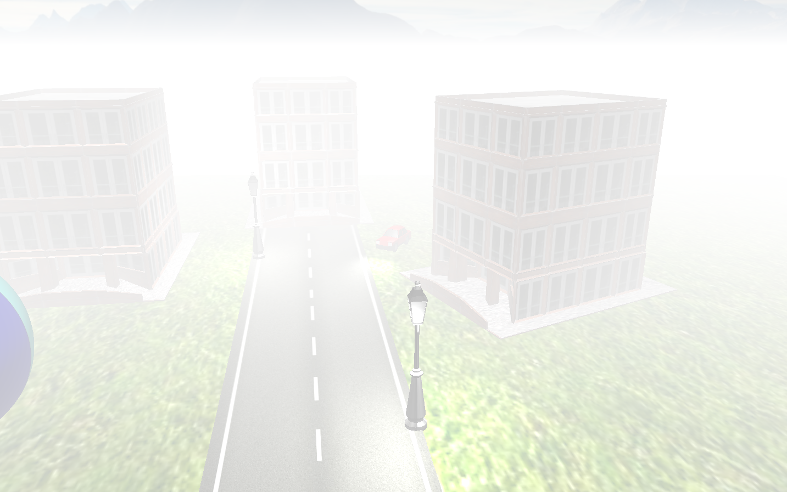
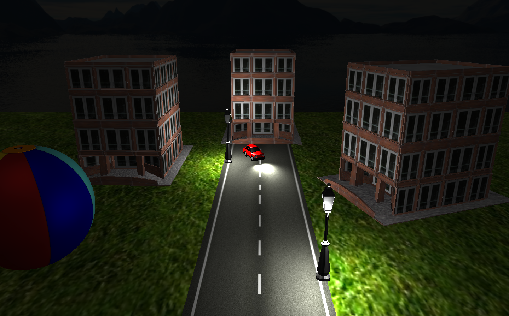

# 3D Car Simulation
3D car simulation (C++ and OpenGL). 

[Download a short video showing how the app works](Demo/demo.mp4) or see screenshots below.

## Functionalities and user guide

### Moving the car
Keys: W, S, A, D.

### Changing car spotlihts' light direction
Keys: left, right, up, down.

### Fog effect
Key: F (turn on/turn off).

### Day/night effect
Key: N (turn on/turn off).

### Choosing the shading mode
Keys:
* 7 - Deferred shadnig (default),
* 8 - Phong shading,
* 9 - Gouraud shading.

### Changing the camera
Keys:
* 1 - not moving, observing the scene,
* 2 - not moving, observing the car,
* 3 - moving with the car (defaut).

## Samples
### Initial view

### Fog effect

### Day/night effect

## Technology
Project coded with C++ with OpenGL library (GLEW, GLFW, GLM). Model loading with ASSIMP library.

## References
All needed references included in the repo. 
Note that, the app needs **assimp-vc140-mt.dll** to work properly. It has been included in Debug folder. 

This project uses some code from [learnopengl.com](https://learnopengl.com/). I highly recommend this tutorial. 

Other references: [GLEW](http://glew.sourceforge.net/), [GLFW](https://www.glfw.org/), [GLM](https://github.com/g-truc/glm), [ASSIMP](https://www.assimp.org/).
